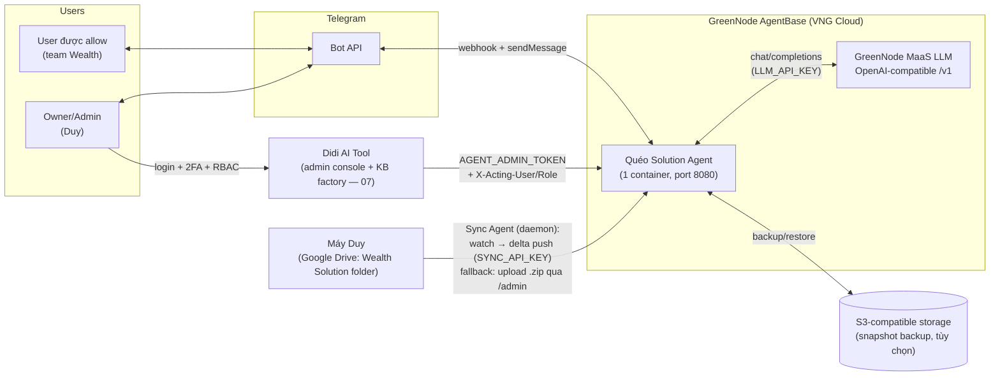
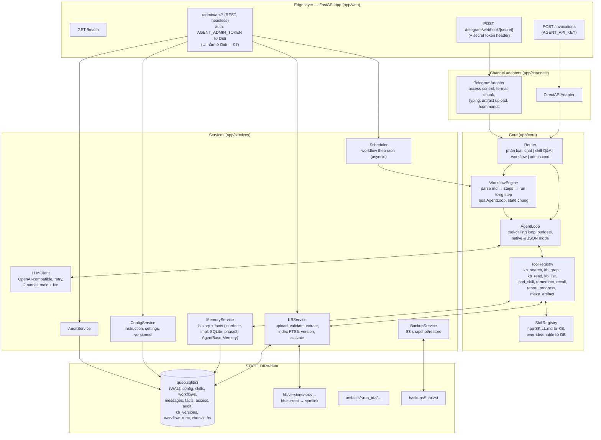
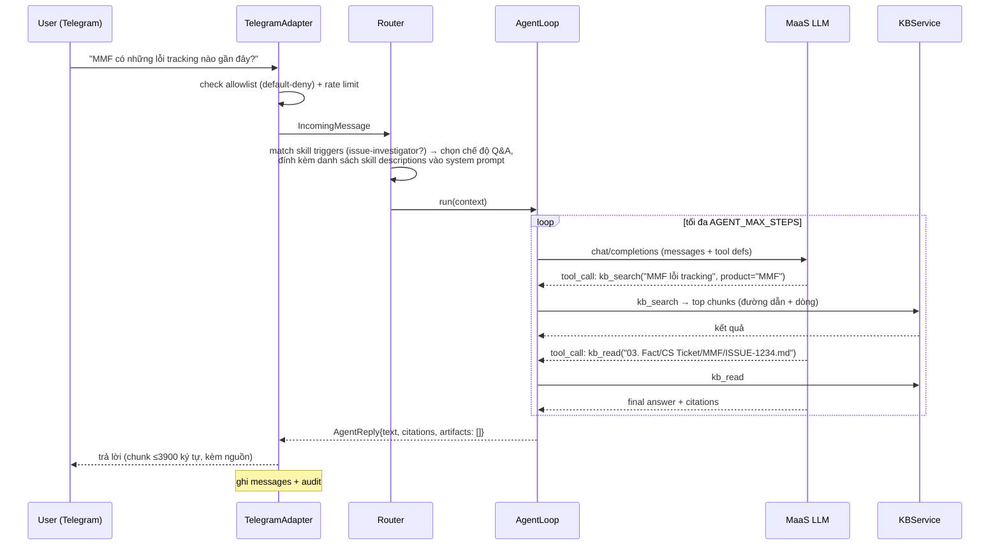
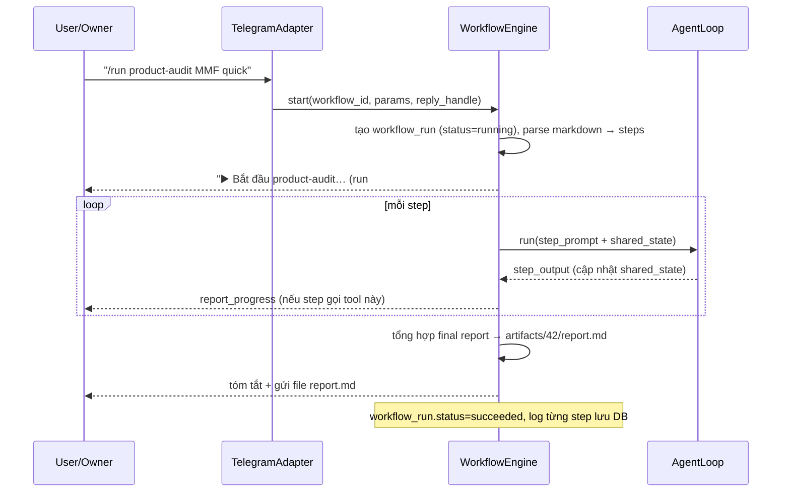

# 01 — Kiến trúc tổng thể

## 1. Mục tiêu & phi mục tiêu

**Mục tiêu (4 yêu cầu gốc):**

1. **Q&A theo skill:** trả lời mọi câu hỏi về Wealth Solution dựa trên KB, tự động kích hoạt skill phù hợp (product-audit, issue-investigator, market-research, …), trả lời có trích nguồn.
2. **Workflow tự động:** user yêu cầu một tác vụ (vd "chạy product audit MMF quick scan") → agent tự thực hiện chuỗi bước theo định nghĩa workflow, báo tiến độ, trả kết quả + artifact.
3. **Admin tool:** cấu hình Instruction / Skill / Workflow, quản lý KB (upload, version, rollback), quản lý allowlist, xem audit log — qua web dashboard + lệnh Telegram.
4. **Telegram bảo mật tuyệt đối:** chỉ user trong allowlist được chat; default-deny; webhook xác thực 2 lớp.

**Phi mục tiêu (v1):** không multi-tenant; không tự ghi ngược vào KB gốc; không vector search (phase 2); không tích hợp trực tiếp Jira/Confluence API (dữ liệu đã nằm trong KB do quy trình sync hiện có của Duy); không UI chat web (Telegram là kênh chat duy nhất).

## 2. Sơ đồ ngữ cảnh (system context)



Luồng dữ liệu KB (tự động — ADR-3 v2): Duy làm việc trên folder `Wealth Solution` như hiện tại → **Sync Agent** (`scripts/queo_sync.py`, chạy nền bằng launchd) phát hiện thay đổi → chờ hết quiet period → so manifest với server → push delta → server tạo version mới, index incremental, auto-activate, nhắn owner trên Telegram. Upload .zip thủ công qua Admin UI vẫn dùng được (lần đầu, hoặc khi delta quá lớn). Chi tiết: `03` §7.

## 3. Thành phần bên trong container



**Nguyên tắc tách lớp:** Core không biết gì về HTTP/Telegram (nhận `IncomingMessage`, trả `AgentReply` — xem `04-INTERFACES.md` §1.1). Channel adapter chỉ map vào/ra. Services không gọi ngược lên Core. Mọi component nhận dependency qua constructor (dễ test).

## 4. Ba luồng chính

### 4.1. Q&A có skill (luồng phổ biến nhất)



### 4.2. Chạy workflow



Workflow chạy **nền** (asyncio task): webhook trả về ngay, user vẫn chat được trong lúc workflow chạy. `/cancel 42` để hủy.

### 4.3. Cập nhật KB

**Đường tự động (mặc định):** xem `03` §7 — Sync Agent push delta, server áp lên version active → version mới → auto-activate → notify owner.

**Đường thủ công (fallback / lần đầu):**

```
Duy (browser) → Didi /agent-admin/knowledge (hoặc curl /admin/api/kb/upload) → upload wealth-kb.zip
  → KBService: validate (size, đuôi file, exclude .git|venv|node_modules|.next|.obsidian|binary lớn)
  → extract vào kb/versions/<n+1>/
  → index: đọc từng file → chunk → ghi chunks_fts (FTS5) với kb_version=n+1
  → SkillRegistry + WorkflowRegistry reload từ version mới (.agents/skills, .agents/workflows)
  → trạng thái "ready" → Duy bấm Activate → symlink kb/current → versions/<n+1> (atomic)
  → backup snapshot lên S3 (nếu bật)
  → rollback = activate lại version cũ (giữ KB_KEEP_VERSIONS=3 bản gần nhất)
```

## 5. Tech stack

| Lớp | Chọn | Ghi chú |
|---|---|---|
| Ngôn ngữ | Python ≥ 3.12 | image `python:3.13-slim` |
| Web | FastAPI + uvicorn | 1 process, async |
| Admin UI | **Không nằm trong agent** — module Agent Admin của Didi AI Tool (Next.js, `07` §4) | agent chỉ expose REST |
| DB | SQLite WAL + FTS5 | 1 file `queo.sqlite3` trong STATE_DIR |
| LLM | GreenNode MaaS, OpenAI-compatible | client tự viết trên `httpx` (retry, timeout); KHÔNG dùng SDK openai (giữ phụ thuộc mỏng) |
| Telegram | gọi thẳng Bot API bằng `httpx` | không dùng python-telegram-bot |
| Zip/backup | `zipfile`, `tarfile` + `zstandard` | |
| S3 backup | `boto3` (chỉ khi `S3_ENDPOINT` set) | optional dependency |
| Scheduler | asyncio loop tự viết (tick 30s, so cron expr bằng `croniter`) | |
| Test | `pytest` + `httpx.ASGITransport` | |

`requirements.txt`: `fastapi, uvicorn[standard], httpx, jinja2, python-multipart, croniter, zstandard, pydantic-settings, boto3 (optional extra)`.

## 6. Repo mới — skeleton bắt buộc

Tạo repo **`queo-solution-agent/`** (đừng sửa đè demo cũ; demo giữ làm tham chiếu):

```
queo-solution-agent/
├── app/
│   ├── main.py                  # tạo FastAPI app, wire dependencies, lifespan (boot: restore S3 → load config → reload registries → start scheduler/polling)
│   ├── cli.py                   # dev CLI: `python -m app.cli chat` (test agent loop không cần Telegram)
│   ├── settings.py              # pydantic-settings, đọc env (xem 05 §2) + validate production
│   ├── web/
│   │   ├── public.py            # /health, /invocations, /telegram/webhook/{secret}
│   │   ├── admin_api.py         # /admin/api/* (REST, JSON — headless, UI ở Didi: 07)
│   │   └── deps.py              # auth dependencies (agent key, AGENT_ADMIN_TOKEN + X-Acting-Role check, sync key)
│   ├── channels/
│   │   ├── base.py              # IncomingMessage, AgentReply, ReplyHandle
│   │   ├── telegram/
│   │   │   ├── adapter.py       # update parsing, access control, dispatch
│   │   │   ├── client.py        # Bot API client (sendMessage, sendDocument, sendChatAction, setWebhook)
│   │   │   ├── commands.py      # /start /help /skills /workflows /run /cancel /whoami + admin cmds
│   │   │   └── polling.py       # dev mode long-polling
│   │   └── direct.py
│   ├── core/
│   │   ├── router.py            # phân loại message → chat | qa | workflow | command
│   │   ├── agent_loop.py        # vòng lặp tool-calling (native + json mode), budgets
│   │   ├── prompts.py           # template system prompt (02 §2)
│   │   ├── tools/
│   │   │   ├── registry.py      # khai báo tool + JSON schema (02 §3)
│   │   │   ├── kb_tools.py      # kb_search, kb_read, kb_list
│   │   │   ├── skill_tools.py   # load_skill
│   │   │   ├── memory_tools.py  # remember, recall
│   │   │   └── run_tools.py     # report_progress, make_artifact
│   │   ├── skills.py            # SkillRegistry
│   │   └── workflows/
│   │       ├── engine.py        # WorkflowEngine
│   │       └── parser.py        # parse workflow markdown → WorkflowSpec
│   ├── services/
│   │   ├── llm.py               # LLMClient (main + lite model)
│   │   ├── kb.py                # KBService: upload pipeline, search, read, versions
│   │   ├── memory.py            # MemoryProvider interface + SQLiteMemory
│   │   ├── config.py            # ConfigService (instructions, settings)
│   │   ├── audit.py
│   │   ├── backup.py            # S3 snapshot/restore
│   │   └── scheduler.py
│   └── db/
│       ├── connection.py        # sqlite WAL, migrations runner
│       └── migrations/          # 0001_init.sql, …  (DDL trong 03 §2)
├── (không có adminui/ — UI quản trị là module Agent Admin trong Didi AI Tool, xem 07 §4)
├── scripts/
│   ├── pack_kb.sh               # chạy trên máy Duy: nén folder Wealth Solution đúng chuẩn (exclude list) → wealth-kb.zip
│   ├── queo_sync.py             # Sync Agent chạy trên máy Duy: watch + delta push (03 §7) — self-contained, chỉ cần python3 + watchdog
│   ├── com.queo.sync.plist      # launchd template để queo_sync chạy nền, tự khởi động lại
│   ├── probe_model.py           # test model MaaS có tool-calling không (05 §4)
│   └── smoke_test.sh            # curl các endpoint sau deploy
├── greennode-agentbase-skills/  # copy nguyên từ repo demo (skills deploy)
├── tests/
├── docs/                        # copy bộ tài liệu này sang
├── Dockerfile
├── .env.example
├── .gitignore  .dockerignore    # phải chứa: .env, .greennode.json, /data, *.sqlite3, .agentbase/
├── requirements.txt
└── README.md
```

## 7. Quan hệ với hệ thống hiện có

- **Tái dùng từ demo (tham chiếu, viết lại sạch):** logic chunking + FTS5 + rerank trong `daily_companion/knowledge.py`; luồng duyệt access Telegram trong `api.py`/`memory.py`; quy ước header `X-GreenNode-AgentBase-User-Id`/`-Session-Id`.
- **KB workspace giữ nguyên cấu trúc.** Server đọc `.agents/skills/**/SKILL.md` và `.agents/workflows/*.md` ngay từ bản KB upload — Duy chỉnh skill/workflow bằng cách sửa file trong workspace rồi upload bản mới, hoặc override nhanh trong Admin UI (lưu DB, ưu tiên hơn file).
- **Cowork/Claude trên máy Duy** vẫn là môi trường "authoring" (tạo skill, chạy knowledge-sync làm sạch KB). Quéo Solution là môi trường "serving" trên cloud cho cả team qua Telegram.
