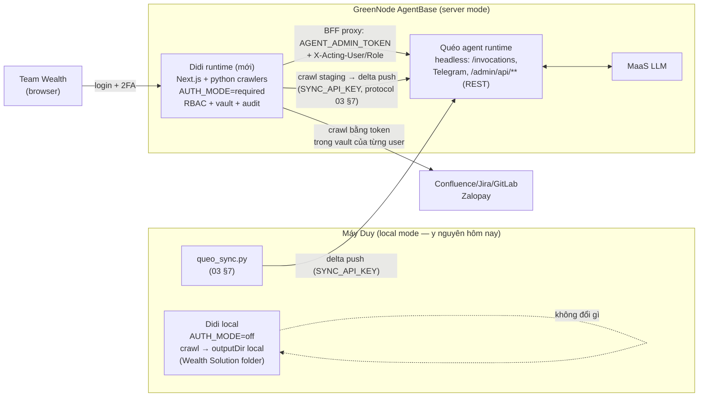

# 07 — Tích hợp Didi AI Tool: platform quản trị + KB factory

> Quyết định 2026-06-11 (ADR-2 v3): **Didi AI Tool là admin console duy nhất** của Quéo Solution (agent bỏ UI, giữ admin API) + **per-user credential vault**. Didi được "platform hóa" thêm 3 lớp nền (auth/RBAC, vault, server mode) rồi deploy lên GreenNode cho team dùng. **Ràng buộc tối thượng: mọi chức năng hiện có của Didi phải chạy y nguyên trên máy Duy — không đổi format config, không đổi thao tác.**

## 1. Hiện trạng Didi AI Tool (khảo sát source 2026-06-11, path `/Users/lap16947/Lab/Didi Ai Tool`)

| Thành phần | Thực tế |
|---|---|
| Stack | Next.js 16 (App Router, webpack build) + TypeScript + Tailwind 4 + zustand; UI components tự viết + @xyflow (workflow editor) |
| Modules (routes) | `/` home, `/knowledge-base` (quản lý crawl task), `/workflows` (chain task, editor kéo thả, new/edit/execute), `/history`, `/settings` |
| API routes (inventory đầy đủ, review code 2026-06-11) | `/api/knowledge-base/{crawl, tasks, test-connection, logs, open-folder, generate-diagram, generate-doc-prompt, generate-image}`, `/api/workflows/{route, execute, tasks, email}`, `/api/history`. Lưu ý server mode: `open-folder` (mở Finder) phải ẩn/disable khi `AUTH_MODE=required`; `workflows/email` cần SMTP env (D4); `generate-*` (Gemini) — key chỉ ở env server-side. `crawl` hiện nhận `apiKey` từ request body + truyền qua process args → điểm sửa chính của D2 (cùng `syncDaemon.js runTask()`) |
| Crawler | Python (`src/scripts/confluence_docs_tools/`): `crawl_confluence.py`, `crawl_jira.py`, `crawl_gitlab.py`; chạy bằng `.venv/bin/python`, spawn từ daemon/API |
| Sync daemon | `src/scripts/worker/syncDaemon.js` — node-cron mỗi phút đọc `data/tasks.json` + `data/workflows.json`, so `isAutoSync/syncFrequency/syncTime/lastSyncTime` → spawn crawler (semaphore 3 process, mutex ghi file, atomic write) |
| State | JSON files: `data/tasks.json` (crawl tasks), `data/workflows.json`, `data/history.json` (100 entry gần nhất), `data/app.pid/app.port` |
| Vận hành local | `Start App.command` / `Stop App.command` / launchd autostart; logs ra `logs/` |
| AI | `@google/generative-ai` (Gemini) dùng trong module knowledge-base |
| **Bảo mật hiện tại** | **Không có auth.** Token nằm ở **3 nơi không bảo vệ**: (1) `.env` (CONFLUENCE_API_KEY/USERNAME, JIRA_API_KEY/USERNAME, GITLAB_PRIVATE_TOKEN); (2) `data/tasks.json` — mỗi task lưu `username` + `apiKey` **plaintext**, daemon truyền token qua **process args**; (3) zustand `persist` → `crawler_settings_store` trong **localStorage browser** (kèm apiKey). Đây là lý do không thể public |

Task shape hiện tại (không được đổi — chỉ được THÊM field optional):
`{id, name, source: confluence|gitlab|jira, url, username, apiKey, outputDir, formats?, rules?, projectId?, groupId?, branch?, projectKey?, jql?, downloadFiles?, isAutoSync, syncFrequency: hourly|daily|weekly, syncTime, lastSyncTime}`

## 2. Kiến trúc target



- **2 runtime tách biệt** trên AgentBase (stack khác nhau, vòng đời deploy khác nhau). Didi server có `STATE_DIR=/data` + S3 snapshot (tái dùng nguyên pattern `03` §5).
- **Didi có 2 mode** bằng env `AUTH_MODE`: `off` (default — local Duy, không auth, hành vi 100% như hôm nay) / `required` (server — bắt buộc login, RBAC, vault).
- **Agent trở thành headless** với admin: giữ nguyên toàn bộ `/admin/api/**` (contract `04` §1.2), bỏ UI Jinja2. Hệ accounts/2FA/RBAC trong `04` §4.2 **triển khai tại Didi** (spec giữ nguyên giá trị, đổi nơi chạy).

## 3. Ba lớp nền mới của Didi (additive — không sửa code cũ)

### 3.1. Auth + RBAC platform (bảo vệ CẢ module cũ lẫn mới)

- **DB mới `data/didi.sqlite3`** (better-sqlite3): các bảng `admin_users`, `admin_sessions`, `admin_tokens` lấy **nguyên DDL** `03` §2.1; thêm `credentials` (§3.2) và `audit_log` (cùng shape `03` §2). JSON files cũ **không đụng**.
- **`src/middleware.ts` (file mới):** `AUTH_MODE=off` → passthrough toàn bộ (local). `required` → mọi route trừ `/login`, `/api/health` đòi session cookie; API đòi session hoặc Bearer token. Spec authn (scrypt, TOTP, lockout, session rotate, bootstrap) lấy **nguyên** `04` §4.2.1 + §4.2.4 — đổi chữ "agent" thành "Didi".
- **RBAC 3 role** (superadmin/operator/viewer) mở rộng ma trận `04` §4.2.2 thêm cột module Collector & Vault:

| Nhóm hành động | superadmin | operator | viewer |
|---|:-:|:-:|:-:|
| Xem KB tasks, workflows, history | ✔ | ✔ | ✔ |
| Tạo/sửa/xóa crawl task & workflow, bấm Run, sửa schedule | ✔ | ✔ | ✖ |
| Quản lý credential **của chính mình** trong vault | ✔ | ✔ | ✔ |
| Xem/sửa credential người khác | ✖ (không ai — kể cả superadmin chỉ revoke được, không đọc được) | ✖ | ✖ |
| Module Agent Admin | theo ma trận `04` §4.2.2 nguyên trạng | … | … |
| Accounts/sessions, settings hệ thống Didi | ✔ | ✖ | ✖ |

- IP allowlist + `DIDI_ENABLED` off-switch + security headers: tái dùng spec `04` §4.2.3.

### 3.2. Per-user credential vault

```sql
CREATE TABLE credentials (
  id INTEGER PRIMARY KEY AUTOINCREMENT,
  user_id INTEGER NOT NULL REFERENCES admin_users(id),
  source TEXT NOT NULL CHECK(source IN ('confluence','jira','gitlab')),
  label TEXT NOT NULL DEFAULT 'default',
  username TEXT NOT NULL,
  token_encrypted BLOB NOT NULL,        -- AES-256-GCM, key = HKDF(DIDI_APP_SECRET, 'cred-vault')
  created_at TEXT NOT NULL, updated_at TEXT NOT NULL, last_used_at TEXT,
  UNIQUE(user_id, source, label)
);
```

- UI: Settings thêm tab **"My Credentials"** (chỉ hiện khi `AUTH_MODE=required`): nhập/đổi/xóa token của chính mình; không bao giờ hiển thị lại plaintext.
- **Task mới** (server mode) lưu `credentialRef: {source}` thay vì `apiKey` — crawl chạy bằng token của **người bấm Run** (hoặc của người tạo lịch, ghi `scheduleOwnerUserId` vào task — field optional mới).
- **Daemon resolve thứ tự:** `task.credentialRef` → vault; không có → `task.apiKey` inline (legacy, local mode) → `.env` default. **Không migrate, không xóa field cũ** — file tasks.json hiện tại chạy nguyên trạng.
- Token không bao giờ vào process args nữa ở server mode: daemon truyền qua **env var của child process** (sửa cách spawn — thêm nhánh mới, nhánh cũ giữ nguyên cho local).

### 3.3. Server mode cho crawl + nối vào KB agent

- Server mode: `outputDir` do server quản lý = `/data/staging/<taskId>/` (UI ẩn field outputDir khi `AUTH_MODE=required`, thay bằng nhãn "→ Agent KB").
- Sau crawl xong: nút/bước **"Push to Agent KB"** — Didi dùng **nguyên protocol Sync** `03` §7.2 (`GET kb/manifest` → diff → `POST kb/delta`) với `SYNC_API_KEY`. Didi server chính là "Sync Agent thứ hai"; máy Duy (queo_sync.py) vẫn là nguồn thứ nhất. Server staging chỉ đẩy **delta phần nó crawl** (path prefix theo cấu trúc workspace, vd `02. Context/Confluence/MMF/**`) — không đụng phần khác của KB.
- Local mode: outputDir local như cũ (crawl về folder Wealth Solution trên máy, queo_sync đẩy lên) — **hai đường cùng tồn tại**.

## 4. Module mới "Agent Admin" trong Didi

- Routes mới `/agent-admin/**` — implement đúng spec trang `04` §3 (trừ Login/Accounts — đã thuộc platform Didi): Dashboard, Instructions, Skills, Workflows, Runs, Knowledge (gồm khối Auto-sync + upload zip), Access, Audit, Settings.
- **Form Skill/Workflow** (trang Skills/Workflows): editor nội dung (markdown) + các trường `command_alias` (preview "user sẽ gõ: /monthly-report-generate", validate charset/trùng), `show_in_menu`, `triggers`, `enabled`, `schedule` (workflow) + nút **"Chạy thử"** (gọi run + mở trang Run theo dõi). Lưu xong hiển thị "✅ Đã áp dụng cho agent — có hiệu lực từ lượt chat kế tiếp" (hot-reload `02` §6.2, không cần deploy/restart gì).
- **BFF pattern:** UI gọi `/api/agent-admin/*` (Next API routes) → proxy sang agent `{AGENT_BASE_URL}/admin/api/**`. Không bao giờ gọi agent trực tiếp từ browser (token không xuống client).
- **Auth giữa Didi ↔ agent:** header `Authorization: Bearer {AGENT_ADMIN_TOKEN}` (service token, ≥32 random) + `X-Acting-User: <username>` + `X-Acting-Role: <role>`. Didi enforce RBAC **trước khi** proxy; agent (defense-in-depth) validate token + check `X-Acting-Role` đủ cấp theo chính ma trận `04` §4.2.2 + ghi audit actor = `didi:<username>`.
- Phía agent (sửa scope M3 — xem §6): bỏ `adminui/` + session/personal-token; `/admin/api/**` chỉ nhận `AGENT_ADMIN_TOKEN`. `SYNC_API_KEY` giữ nguyên cho sync endpoints.

## 5. Hợp đồng zero-regression (BẤT BIẾN — vi phạm là fail review)

1. `data/tasks.json`, `workflows.json`, `history.json`: **không đổi schema hiện có**, chỉ THÊM field optional (`credentialRef`, `scheduleOwnerUserId`). File hiện tại của Duy mở bằng bản mới chạy được ngay.
2. Mọi route/page/API path hiện có **giữ nguyên**; module mới chỉ thêm route mới.
3. `crawl_confluence.py` / `crawl_jira.py` / `crawl_gitlab.py`: **không sửa** (server mode truyền token qua env → crawler đọc args như cũ, wrapper mới lo phần env→args ngay trước spawn trong process con — không đụng script).
4. `Start App.command`, `Stop App.command`, launchd flow: không đổi. `AUTH_MODE` không set = `off` = hành vi hệt hôm nay (kể cả settings localStorage).
5. syncDaemon: logic cũ giữ nguyên; chỉ thêm nhánh resolve credentialRef + nhánh spawn-bằng-env. Task cũ (apiKey inline) đi đúng code path cũ.
6. **Regression checklist R1–R7** chạy sau MỖI milestone D: R1 `Start App.command` boot OK, port cũ; R2 mở 5 trang cũ không lỗi console; R3 chạy tay 1 crawl task Confluence có sẵn → file về đúng outputDir cũ; R4 daemon auto-sync 1 task hourly chạy đúng giờ + ghi history; R5 workflow execute chuỗi 2 task OK; R6 sửa settings localStorage vẫn hoạt động (local mode); R7 `git diff` xác nhận không sửa file trong danh sách bất biến (crawlers, *.command).

## 6. Tác động lên thiết kế agent (cập nhật các doc khác)

| Doc | Thay đổi |
|---|---|
| `00` ADR-2 | → v3: Didi là console duy nhất; agent headless |
| `01` | Diagram + skeleton: bỏ `adminui/`, `web/admin_ui.py`; thêm ghi chú UI ở Didi |
| `03` §2.1 | DDL accounts **triển khai tại Didi** (didi.sqlite3); agent không chạy migration này → agent chỉ còn `0003_kb_sync.sql` |
| `04` §1.0, §3, §4.2 | Admin auth phía agent = `AGENT_ADMIN_TOKEN` + X-Acting-*; spec trang & RBAC giữ nguyên, nơi implement = Didi |
| `05` | Env agent: bỏ nhóm `ADMIN_*`, thêm `AGENT_ADMIN_TOKEN`; M3 thu gọn (API only, ~1 ngày); thêm con trỏ D-series |

## 7. Kế hoạch triển khai D-series (làm SAU M2 của agent, song song M4-M5 được)

> Mỗi milestone kết thúc bằng: pytest/vitest mới + **regression R1–R7 pass** + commit. Làm trên branch, Duy vẫn dùng bản đang chạy.

| MS | Nội dung | Thời lượng | Acceptance chính |
|---|---|---|---|
| **D0 — Nền** | better-sqlite3 + `didi.sqlite3` (migrations users/sessions/tokens/credentials/audit); `middleware.ts` AUTH_MODE skeleton (off=passthrough); env mới; chạy regression baseline lần đầu ghi nhận hành vi cũ | 0,5 ngày | AUTH_MODE=off: R1–R7 pass; AUTH_MODE=required: mọi route redirect /login (chưa có account = chỉ bootstrap được) |
| **D1 — Auth + RBAC + Accounts** | Login page + scrypt + TOTP + lockout + bootstrap superadmin (spec `04` §4.2.1/4.2.4); trang Accounts; gắn `require_role` vào mọi API route khi required; audit_log | 1 ngày | Ma trận role × API test pass (viewer bị 403 khi mutate); login flow đủ (ép đổi pass → ép 2FA); R1–R7 pass ở mode off |
| **D2 — Credential vault** | Bảng credentials + AES-GCM; tab My Credentials; task mới dùng credentialRef; daemon resolve 3 cấp + spawn-env; superadmin revoke (không đọc) credential | 0,5–1 ngày | Crawl bằng vault token của user bấm Run thành công; task cũ apiKey inline vẫn chạy (R3/R4); grep log/args không lộ token |
| **D3 — Agent Admin module** | `/agent-admin/**` 9 trang theo `04` §3; BFF proxy + AGENT_ADMIN_TOKEN + X-Acting-*; phía agent: bỏ UI, nhận service token (sửa M3) | 1–1,5 ngày | Từ Didi: sửa persona → Quéo đổi giọng; upload/activate KB; duyệt user Telegram; xem run log; audit phía agent ghi `didi:<username>`; viewer chỉ xem được |
| **D4 — Server deploy** | Dockerfile (node:22-slim + python3 + venv crawlers + next build standalone); STATE_DIR + S3 snapshot; deploy AgentBase PUBLIC + `DIDI_IP_ALLOWLIST`; staging→delta push KB; checklist bảo mật (map `04` §4.3 sang Didi) | 1 ngày | Login từ browser ngoài → 2FA → crawl bằng token vault → Push to Agent KB → hỏi Quéo thấy tri thức mới; redeploy không mất state; **verify outbound: runtime gọi được các host nội bộ cần crawl** (xem rủi ro dưới) |

**Env mới của Didi:** `AUTH_MODE` (off), `DIDI_APP_SECRET` (✔ server), `DIDI_BOOTSTRAP_USER/PASSWORD` (✔ lần đầu server), `DIDI_REQUIRE_2FA` (true ở server), `DIDI_IP_ALLOWLIST`, `DIDI_ENABLED`, `AGENT_BASE_URL`, `AGENT_ADMIN_TOKEN`, `AGENT_SYNC_API_KEY`, `STATE_DIR`, `S3_*` (như agent), `GEMINI_API_KEY` (shared, server-side only — không còn ở client).

## 8. Rủi ro riêng của phần tích hợp

| Rủi ro | Mức | Đối sách |
|---|---|---|
| **GreenNode runtime không route được tới Confluence/GitLab nội bộ Zalopay** (corp network/VPN-only) | **Cao — phải verify sớm** | Test ngay đầu D4 bằng 1 curl từ runtime. Nếu không tới được: crawl vẫn chạy **local mode** trên máy Duy (như hôm nay) + server chỉ làm admin/Agent Admin/vault; hoặc xin VPC mode + route nội bộ (AgentBase hỗ trợ `networkConfig` VPC — nhưng khi đó Didi cần cách khác để user truy cập). Kiến trúc 2-mode đã thiết kế sẵn cho tình huống này — không blocker |
| Next.js 16 + better-sqlite3 + python trong 1 image | Thấp | multi-stage build; `next build` standalone output; image ~600MB-1GB chấp nhận được |
| tasks.json cũ chứa apiKey plaintext bị đẩy lên server | Trung bình | server mode KHÔNG import tasks.json từ máy Duy; tasks server tạo mới từ đầu với credentialRef; nếu cần import → script strip apiKey |
| Settings localStorage còn token trên browser cũ | Thấp | local mode chấp nhận (máy cá nhân Duy); server mode không dùng localStorage cho secrets; ghi chú dọn localStorage trong D4 |
| 2 nơi quản trị trong lúc chuyển tiếp (agent M3 đã build UI?) | — | Không xảy ra: quyết định này có TRƯỚC khi code M3 → M3 build API-only ngay từ đầu |
