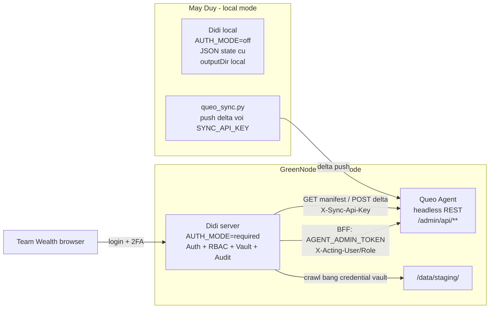

# Plan V2 - Codex Review: Tich hop quan tri Agent vao Didi AI Tool

Trang thai: ban V2 da chinh sau review Codex, du de dung lam input coding.

Pham vi: platform hoa Didi AI Tool thanh admin console duy nhat cho Queo Solution, them auth/RBAC, per-user credential vault, server mode crawler, BFF proxy sang agent headless, va luong push KB delta sang Queo Agent.

Nguon doi chieu:

- `docs/queo-solution/07-DIDI-INTEGRATION.md`
- `docs/queo-solution/04-INTERFACES.md`
- `docs/queo-solution/03-DATA-AND-KB.md`
- Source Didi hien tai tai `/Users/lap16947/Lab/Didi Ai Tool`

Khuyen nghi: giu file V1 `PLAN.md` lam tham chieu, dung file V2 nay lam ban coding chinh.

---

## 0. Tom tat thay doi V2 so voi V1

| Van de trong V1 | Rui ro | Quyet dinh V2 |
|---|---|---|
| RBAC proxy map theo method chung chung (`GET=viewer`, `POST=operator`) | Sai spec: `POST /kb/search-test` phai cho viewer, `PATCH /settings` phai superadmin | Tao matcher endpoint chinh xac trong `src/lib/agent-admin/rbac.ts`, dung chung cho BFF va test matrix |
| Middleware chi check co cookie | Cookie gia/het han van qua duoc page; thieu CSRF, security headers, `DIDI_ENABLED`, Bearer token | Middleware chi la lop stateless, con validate DB nam trong `requireSession()` cho moi API/page mutation |
| Bootstrap fallback password mac dinh | Fail security production | Production ma DB trong + thieu `DIDI_BOOTSTRAP_*` thi fail-fast, khong dung fallback password |
| Accounts nam trong `/agent-admin/accounts` | Sai boundary: Accounts la platform Didi, khong phai nghiep vu agent | Doi thanh route platform `/accounts`; `/agent-admin/**` chi gom dashboard, instructions, skills, workflows, runs, knowledge, access, audit, settings |
| Vault chua noi vao API/UI cu | Server mode van doi `apiKey`, van gui secret tu browser, van truyen token qua argv | Them `credentialRef`, sua crawl/test-connection/tasks UI va API theo `AUTH_MODE=required`, token chi resolve server-side |
| Python wrapper co `import path`, va mo ta token an chua chat | Copy code se loi runtime; token co the lo neu Node spawn sai | Wrapper whitelist script + `runpy.run_path`; Node spawn wrapper voi env `CRAWLER_API_KEY`, argv khong co secret |
| BFF proxy doc body bang `arrayBuffer()` cho moi request | Upload KB zip lon co the no RAM | JSON dung arrayBuffer; multipart/large upload proxy bang stream trong Node runtime |
| IP allowlist chi exact match | Khong dung CIDR nhu spec | Implement CIDR parser helper, test `x-forwarded-for` hop dau theo AgentBase ingress |
| Thieu route matrix cho API cu cua Didi | Viewer/operator co the mutate ngoai y muon | Bao boc tat ca route `/api/knowledge-base/**`, `/api/workflows/**`, `/api/history` bang `requireRole()` khi `AUTH_MODE=required` |

---

## 1. Muc tieu va bat bien

### 1.1. Muc tieu

1. Didi AI Tool la admin console duy nhat cua Queo Solution.
2. Queo Agent bo UI, chi expose REST `/admin/api/**`.
3. Didi server mode co login, 2FA, RBAC, audit, vault va BFF proxy.
4. Didi local mode tren may Duy van chay y nguyen nhu hien tai.
5. Credential cua Confluence/Jira/GitLab khong con di tu browser xuong server khi `AUTH_MODE=required`.
6. Crawler server mode co the crawl vao staging va push delta sang Agent KB.

### 1.2. Bat bien zero-regression

1. Khong doi format bat buoc cua `data/tasks.json`, `workflows.json`, `history.json`; chi them field optional.
2. Khong doi route/page/API cu: `/`, `/knowledge-base`, `/workflows`, `/history`, `/settings`, `/api/knowledge-base/**`, `/api/workflows/**`, `/api/history`.
3. Khong sua cac crawler goc `crawl_confluence.py`, `crawl_jira.py`, `crawl_gitlab.py`.
4. Khong sua flow `Start App.command`, `Stop App.command`, launchd local.
5. `AUTH_MODE` khong set thi default `off`, hanh vi local giong hien tai.
6. Server mode khong import `data/tasks.json` local cua Duy len runtime production.
7. Khong log secret, khong audit secret, khong truyen secret qua process args trong server mode.

### 1.3. Non-goals cua V2

- Khong migrate tat ca task local sang vault.
- Khong thay the workflow editor hien co.
- Khong lam multi-tenant.
- Khong lam vector search hay parse PDF/XLSX cho Queo Agent.
- Khong cho browser goi truc tiep Queo Agent admin API.

---

## 2. Ground truth source Didi hien tai

Didi hien tai la Next.js 16 App Router, TypeScript, Tailwind 4, zustand, `@xyflow/react`, `node-cron`, Python crawler trong `.venv`.

Routes hien co:

- Pages: `/`, `/knowledge-base`, `/workflows`, `/history`, `/settings`
- APIs:
  - `/api/knowledge-base/crawl`
  - `/api/knowledge-base/tasks`
  - `/api/knowledge-base/test-connection`
  - `/api/knowledge-base/logs`
  - `/api/knowledge-base/open-folder`
  - `/api/knowledge-base/generate-diagram`
  - `/api/knowledge-base/generate-doc-prompt`
  - `/api/knowledge-base/generate-image`
  - `/api/workflows`
  - `/api/workflows/tasks`
  - `/api/workflows/execute`
  - `/api/workflows/email`
  - `/api/history`

State hien co:

- `data/tasks.json`
- `data/workflows.json`
- `data/history.json`
- `data/app.pid`
- `data/app.port`
- `data/syncDaemon.pid`

Luu y bao mat: `data/tasks.json` hien co chua credential plaintext. Khong trich lai gia tri nao trong doc, khong dua file nay vao deploy server.

---

## 3. Kien truc target



Hai runtime tach biet:

- Didi server: Next.js + SQLite `didi.sqlite3` + Python crawlers.
- Queo Agent: FastAPI + `queo.sqlite3` + KB/index + Telegram.

---

## 4. Route va boundary V2

### 4.1. Platform Didi routes

Các route này thuộc chính Didi, không proxy sang Queo Agent:

- `/login`
- `/change-password`
- `/setup-2fa`
- `/accounts` - chi superadmin
- `/credentials` hoặc tab "My Credentials" trong `/settings`
- Existing collector routes: `/knowledge-base`, `/workflows`, `/history`, `/settings`

Platform APIs:

- `/api/auth/[...action]`
- `/api/me`
- `/api/accounts/**`
- `/api/sessions/**`
- `/api/tokens/**`
- `/api/credentials/**`
- `/api/security/csrf`
- Existing APIs cua Didi, duoc bao ve boi RBAC khi `AUTH_MODE=required`

### 4.2. Agent Admin routes

Các route này render trong Didi, gọi Queo Agent qua BFF:

- `/agent-admin`
- `/agent-admin/dashboard`
- `/agent-admin/instructions`
- `/agent-admin/skills`
- `/agent-admin/workflows`
- `/agent-admin/runs`
- `/agent-admin/knowledge`
- `/agent-admin/access`
- `/agent-admin/audit`
- `/agent-admin/settings`

Khong dat `/agent-admin/accounts`; Accounts la platform Didi.

### 4.3. BFF route

- Browser gọi: `/api/agent-admin/[...path]`
- Didi server proxy sang: `{AGENT_BASE_URL}/admin/api/[...path]`
- Headers Didi them:
  - `Authorization: Bearer ${AGENT_ADMIN_TOKEN}`
  - `X-Acting-User: <username>`
  - `X-Acting-Role: <role>`

Browser khong bao gio nhan `AGENT_ADMIN_TOKEN`.

---

## 5. Cau truc file de implement

```text
Didi Ai Tool/
├── Dockerfile                                      # NEW, chi dung server deploy
├── data/
│   ├── didi.sqlite3                                # NEW, khong commit/deploy local state
│   ├── tasks.json                                  # EXISTING, chi them optional fields
│   ├── workflows.json                              # EXISTING
│   └── history.json                                # EXISTING
├── src/
│   ├── middleware.ts                               # NEW, stateless gate + headers
│   ├── app/
│   │   ├── login/page.tsx                          # NEW
│   │   ├── change-password/page.tsx                # NEW
│   │   ├── setup-2fa/page.tsx                      # NEW
│   │   ├── accounts/page.tsx                       # NEW, platform Didi
│   │   ├── credentials/page.tsx                    # NEW or merge into settings
│   │   ├── agent-admin/...                         # NEW, agent business admin pages
│   │   ├── api/auth/[...action]/route.ts           # NEW
│   │   ├── api/me/route.ts                         # NEW
│   │   ├── api/accounts/...                        # NEW
│   │   ├── api/credentials/...                     # NEW
│   │   ├── api/agent-admin/[...path]/route.ts      # NEW
│   │   ├── api/knowledge-base/push-to-agent/route.ts # NEW
│   │   └── api/{existing}/...                      # MODIFY: requireRole + server mode
│   ├── components/
│   │   ├── auth/                                   # NEW
│   │   ├── credentials/                            # NEW
│   │   └── agent-admin/                            # NEW
│   ├── lib/
│   │   ├── db.ts                                   # NEW
│   │   ├── migrations.ts                           # NEW
│   │   ├── crypto.ts                               # NEW
│   │   ├── auth/
│   │   │   ├── password.ts                         # NEW
│   │   │   ├── totp.ts                             # NEW
│   │   │   ├── session.ts                          # NEW
│   │   │   ├── csrf.ts                             # NEW
│   │   │   └── ip.ts                               # NEW
│   │   ├── rbac/
│   │   │   ├── roles.ts                            # NEW
│   │   │   ├── didi-rbac.ts                        # NEW
│   │   │   └── agent-admin-rbac.ts                 # NEW
│   │   ├── credentials/vault.ts                    # NEW
│   │   ├── audit.ts                                # NEW
│   │   └── env.ts                                  # NEW
│   └── scripts/
│       ├── worker/syncDaemon.js                    # MODIFY
│       └── confluence_docs_tools/crawlers_wrapper.py # NEW
└── package.json                                    # MODIFY
```

Package additions:

- `better-sqlite3`
- `@types/better-sqlite3`
- `qrcode` and `@types/qrcode` neu muon render QR TOTP server-side
- CIDR helper: uu tien tu viet nho trong `src/lib/auth/ip.ts`; neu can dependency thi dung `ipaddr.js`

---

## 6. Data model `data/didi.sqlite3`

### 6.1. Migration runner

Them bang migration de idempotent va co rollback tinh than:

```sql
CREATE TABLE IF NOT EXISTS schema_migrations (
  id TEXT PRIMARY KEY,
  applied_at TEXT NOT NULL
);
```

`src/lib/db.ts` khong chi `CREATE TABLE IF NOT EXISTS` scattered. Nen co `runMigrations()` voi danh sach migration ro rang.

### 6.2. DDL chinh

```sql
PRAGMA journal_mode=WAL;
PRAGMA foreign_keys=ON;

CREATE TABLE IF NOT EXISTS admin_users (
  id INTEGER PRIMARY KEY AUTOINCREMENT,
  username TEXT UNIQUE NOT NULL,
  password_hash TEXT NOT NULL,
  role TEXT NOT NULL CHECK(role IN ('superadmin','operator','viewer')),
  status TEXT NOT NULL DEFAULT 'active' CHECK(status IN ('active','disabled')),
  totp_secret TEXT,
  must_change_password INTEGER NOT NULL DEFAULT 1,
  failed_attempts INTEGER NOT NULL DEFAULT 0,
  locked_until TEXT,
  last_login_at TEXT,
  last_login_ip TEXT,
  created_by TEXT,
  created_at TEXT NOT NULL,
  updated_at TEXT NOT NULL
);

CREATE TABLE IF NOT EXISTS admin_sessions (
  token_hash TEXT PRIMARY KEY,
  user_id INTEGER NOT NULL REFERENCES admin_users(id) ON DELETE CASCADE,
  created_at TEXT NOT NULL,
  expires_at TEXT NOT NULL,
  last_seen_at TEXT NOT NULL,
  ip TEXT,
  user_agent TEXT
);
CREATE INDEX IF NOT EXISTS idx_admin_sessions_user
  ON admin_sessions(user_id, expires_at);

CREATE TABLE IF NOT EXISTS admin_tokens (
  id INTEGER PRIMARY KEY AUTOINCREMENT,
  user_id INTEGER NOT NULL REFERENCES admin_users(id) ON DELETE CASCADE,
  name TEXT NOT NULL,
  token_hash TEXT UNIQUE NOT NULL,
  expires_at TEXT NOT NULL,
  last_used_at TEXT,
  revoked INTEGER NOT NULL DEFAULT 0,
  created_at TEXT NOT NULL
);

CREATE TABLE IF NOT EXISTS credentials (
  id INTEGER PRIMARY KEY AUTOINCREMENT,
  user_id INTEGER NOT NULL REFERENCES admin_users(id) ON DELETE CASCADE,
  source TEXT NOT NULL CHECK(source IN ('confluence','jira','gitlab')),
  label TEXT NOT NULL DEFAULT 'default',
  username TEXT NOT NULL,
  token_encrypted BLOB NOT NULL,
  created_at TEXT NOT NULL,
  updated_at TEXT NOT NULL,
  last_used_at TEXT,
  revoked INTEGER NOT NULL DEFAULT 0,
  UNIQUE(user_id, source, label)
);
CREATE INDEX IF NOT EXISTS idx_credentials_owner_source
  ON credentials(user_id, source, label);

CREATE TABLE IF NOT EXISTS audit_log (
  id INTEGER PRIMARY KEY AUTOINCREMENT,
  actor TEXT NOT NULL,
  action TEXT NOT NULL,
  target TEXT,
  detail TEXT,
  ip TEXT,
  user_agent TEXT,
  created_at TEXT NOT NULL
);
CREATE INDEX IF NOT EXISTS idx_audit_action_time
  ON audit_log(action, created_at);
CREATE INDEX IF NOT EXISTS idx_audit_actor_time
  ON audit_log(actor, created_at);

CREATE TABLE IF NOT EXISTS login_failures (
  id INTEGER PRIMARY KEY AUTOINCREMENT,
  username_hash TEXT,
  ip TEXT,
  reason TEXT NOT NULL,
  created_at TEXT NOT NULL
);
CREATE INDEX IF NOT EXISTS idx_login_failures_ip_time
  ON login_failures(ip, created_at);
```

### 6.3. Secret handling

- `totp_secret` ma hoa bang AES-256-GCM voi key HKDF tu `DIDI_APP_SECRET`, info `totp-secret`.
- `credentials.token_encrypted` ma hoa bang AES-256-GCM voi key HKDF tu `DIDI_APP_SECRET`, info `cred-vault`.
- Khong luu plaintext token trong DB, audit, log, localStorage server mode.

---

## 7. Auth, session, CSRF va middleware

### 7.1. Env

```text
AUTH_MODE=off|required
DIDI_APP_SECRET=
DIDI_BOOTSTRAP_USER=
DIDI_BOOTSTRAP_PASSWORD=
DIDI_REQUIRE_2FA=true
DIDI_IP_ALLOWLIST=
DIDI_ENABLED=true
DIDI_SESSION_TTL_HOURS=12
DIDI_SESSION_IDLE_MINUTES=60
AGENT_BASE_URL=
AGENT_ADMIN_TOKEN=
AGENT_SYNC_API_KEY=
STATE_DIR=/data
GEMINI_API_KEY=
S3_ENDPOINT=
S3_BUCKET=
S3_ACCESS_KEY=
S3_SECRET_KEY=
S3_REGION=
```

Production fail-fast:

- `AUTH_MODE=required`
- `DIDI_APP_SECRET` length >= 32
- Neu `admin_users` trong thi bat buoc co `DIDI_BOOTSTRAP_USER` va `DIDI_BOOTSTRAP_PASSWORD`
- `DIDI_BOOTSTRAP_PASSWORD` phai >= 12 ky tu
- `AGENT_ADMIN_TOKEN` length >= 32 neu bat Agent Admin
- `AGENT_BASE_URL` bat buoc neu bat Agent Admin

Khong co fallback password mac dinh trong production.

### 7.2. Middleware dung viec gi

`src/middleware.ts` chi lam lop stateless:

1. `AUTH_MODE=off`: passthrough.
2. `DIDI_ENABLED=false`: tra 404 moi route.
3. Security headers cho moi response.
4. IP allowlist CIDR neu set.
5. Redirect ve `/login` neu page protected khong co cookie `qs_session`.
6. API protected khong co cookie/Bearer thi 401.

Middleware khong import `better-sqlite3`, vi Next middleware khong phu hop native SQLite. Validate session that su nam o server helper.

### 7.3. Authoritative auth helper

Tao `src/lib/auth/session.ts`:

- `getSessionFromRequest(req)`
- `requireSession(req)`
- `requireRole(req, minRoleOrPredicate)`
- `requireCsrf(req, session)`
- `rotateSession(userId, req)`
- `destroySession(token)`
- `destroyAllSessions(userId)`

Moi API mutation phai goi `requireCsrf`, tru khi auth bang personal Bearer token.

Session query can check:

- token hash ton tai
- `expires_at > now`
- `last_seen_at` chua vuot idle timeout
- user active
- update `last_seen_at`

### 7.4. Cookie

- Name: `qs_session`
- HttpOnly
- Secure khi production
- SameSite=Strict
- Path=/
- Max-Age theo TTL

### 7.5. Login flow

1. User nhap username/password.
2. Delay toi thieu 1s cho fail de giam brute force.
3. Khong phan biet user khong ton tai/sai password/sai OTP trong message.
4. Password dung nhung user dang locked: hien lockout sau khi da xac thuc password dung.
5. Neu `must_change_password=1`, redirect `/change-password`.
6. Neu `DIDI_REQUIRE_2FA=true` va chua co TOTP, redirect `/setup-2fa`.
7. Neu co TOTP thi yeu cau OTP, chap nhan ±1 time-step 30s.
8. Login thanh cong: reset failed attempts, rotate session, audit `login_ok`.

### 7.6. TOTP

Khong them dependency TOTP. Tu implement RFC 6238:

- Secret random 20 bytes, Base32.
- `otpauth://totp/Queo:<username>?secret=<secret>&issuer=Queo`.
- Chi enable sau khi user verify OTP dung.
- Secret at-rest encrypted.

### 7.7. CSRF

CSRF token:

- Server tao token bind voi session token hash + timestamp.
- Ky bang HMAC-SHA256 voi `DIDI_APP_SECRET`.
- Client gui header `X-CSRF-Token`.
- Moi mutation form/fetch can token.
- Bearer personal token duoc mien CSRF.

---

## 8. RBAC V2

Role order:

```ts
viewer < operator < superadmin
```

### 8.1. Agent Admin BFF RBAC

Implement trong `src/lib/agent-admin/rbac.ts` bang pattern matcher method + pathname.

| Pattern | Role toi thieu |
|---|---|
| `GET /admin/api/**` | viewer |
| `POST /admin/api/kb/search-test` | viewer |
| `POST /admin/api/instructions` | operator |
| `POST /admin/api/instructions/:id/activate` | operator |
| `POST /admin/api/skills` | operator |
| `PATCH /admin/api/skills/:id` | operator |
| `POST /admin/api/workflows` | operator |
| `PATCH /admin/api/workflows/:id` | operator |
| `POST /admin/api/workflows/:id/run` | operator |
| `POST /admin/api/runs/:id/cancel` | operator |
| `POST /admin/api/kb/upload` | operator |
| `POST /admin/api/kb/:id/activate` | operator |
| `POST /admin/api/kb/delta` | operator |
| `POST /admin/api/access/:id` | operator |
| `PATCH /admin/api/settings` | superadmin |
| `POST /admin/api/backup` | superadmin |
| `POST /admin/api/backup/restore` | superadmin |

Default: deny, khong default `POST=operator`.

### 8.2. Didi platform va collector RBAC

Implement trong `src/lib/rbac/didi-rbac.ts`.

| Route | viewer | operator | superadmin | Ghi chu |
|---|:-:|:-:|:-:|---|
| `GET /api/knowledge-base/tasks` | yes | yes | yes | Read task metadata, server mode phai mask `apiKey` |
| `POST /api/knowledge-base/tasks` | no | yes | yes | Create/update/delete tasks |
| `POST /api/knowledge-base/crawl` | no | yes | yes | Run crawler |
| `POST /api/knowledge-base/test-connection` | yes | yes | yes | Chi credential cua chinh user |
| `GET /api/knowledge-base/logs` | yes | yes | yes | Log da mask secrets |
| `POST /api/knowledge-base/open-folder` | no | no | no | Server mode tra 404; local mode nhu cu |
| `POST /api/knowledge-base/generate-*` | no | yes | yes | Ton LLM cost, co the xu ly noi dung nhay cam |
| `GET /api/workflows` | yes | yes | yes | |
| `POST /api/workflows` | no | yes | yes | |
| `DELETE /api/workflows` | no | yes | yes | |
| `GET /api/workflows/tasks` | yes | yes | yes | |
| `POST /api/workflows/execute` | no | yes | yes | |
| `POST /api/workflows/email` | no | yes | yes | |
| `GET /api/history` | yes | yes | yes | |
| `POST /api/history` | no | yes | yes | |
| `DELETE /api/history` | no | yes | yes | |
| `/api/accounts/**` | no | no | yes | |
| `/api/credentials/**` own credential | yes | yes | yes | Khong ai doc plaintext |
| `/api/sessions/**` own session | yes | yes | yes | Superadmin co the revoke session nguoi khac |
| `/api/tokens/**` own token | yes | yes | yes | |

UI an nut theo role, nhung API moi la enforcement.

---

## 9. Credential Vault V2

### 9.1. Task shape optional moi

Khong doi task cu. Them optional fields:

```ts
type CredentialRef = {
  source: 'confluence' | 'jira' | 'gitlab';
  label?: string; // default
};

type CrawlTask = ExistingTask & {
  credentialRef?: CredentialRef;
  createdByUserId?: number;
  scheduleOwnerUserId?: number;
};
```

Server mode task moi:

- `apiKey` de empty string hoac undefined.
- `credentialRef` bat buoc.
- `createdByUserId` la user dang login.
- Neu enable schedule, `scheduleOwnerUserId` bat buoc, mac dinh user dang login.

Local mode task cu:

- `apiKey` van hoat dong nhu hien tai.
- `credentialRef` neu co thi ignore, tru khi `AUTH_MODE=required`.

### 9.2. Resolve credential

Tao `src/lib/credentials/vault.ts`:

```ts
resolveCredential({
  source,
  label,
  actorUserId,
  scheduleOwnerUserId,
  mode,
  legacyApiKey,
  legacyUsername,
})
```

Thu tu server mode:

1. Manual run: dung credential cua actor dang bam Run.
2. Scheduled run: dung credential cua `scheduleOwnerUserId`.
3. Neu credential revoked/missing: fail ro rang, audit `credential_missing`, khong fallback sang plaintext.
4. Env fallback chi duoc bat neu `DIDI_ALLOW_ENV_CREDENTIAL_FALLBACK=true`; mac dinh false server mode.

Thu tu local mode:

1. `task.apiKey` inline.
2. Env cu `.env`.
3. Neu co `credentialRef` va user context ton tai thi co the resolve vault, nhung khong bat buoc.

### 9.3. UI thay doi trong `/knowledge-base`

Khi `AUTH_MODE=off`:

- Giu form `apiKey`, `username`, `outputDir`, localStorage nhu hien tai.

Khi `AUTH_MODE=required`:

- Khong render input `apiKey`.
- Render selector credential theo source: `default`, label khac.
- Neu chua co credential, link toi `/credentials`.
- `outputDir` bi an, hien label "Agent KB staging".
- Save task ghi `credentialRef`, `apiKey: ""`, `scheduleOwnerUserId`.
- Run/test connection gui `credentialRef`, khong gui token.
- Client khong doc `crawler_settings_store.defaults.*.apiKey`.

### 9.4. API thay doi

`POST /api/knowledge-base/crawl`:

- Local mode: chap nhan payload cu voi `apiKey`.
- Server mode: reject payload co `apiKey` non-empty bang 400 hoac ignore va audit; yeu cau `credentialRef`.
- Resolve credential server-side tu session.
- Token chi dua vao child env.

`POST /api/knowledge-base/test-connection`:

- Local mode: payload cu.
- Server mode: payload moi `{source, url, credentialRef, ...sourceFields}`.
- Server resolve credential cua chinh user.

`GET /api/knowledge-base/tasks`:

- Server mode mask `apiKey` truoc khi tra ve client.
- Khong tra plaintext token du da ton tai trong JSON.

`POST /api/knowledge-base/tasks`:

- Server mode sanitize task: xoa/mask `apiKey`, validate `credentialRef`, set owner fields server-side.

---

## 10. Crawler wrapper va process secret hygiene

### 10.1. Node spawn server mode

Khong spawn crawler goc truc tiep trong server mode.

```ts
const args = [
  wrapperPath,
  task.source,
  '--base-url', task.url,
  '--output-dir', finalOutputDir,
  // cac arg khong nhay cam khac
];

spawn(venvPython, args, {
  env: {
    ...safeEnv(process.env),
    CRAWLER_USERNAME: resolved.username,
    CRAWLER_API_KEY: resolved.token,
  },
});
```

`args` khong bao gio co username/token trong server mode. Username cung xem la sensitive vi gan voi corp account.

Local mode giu path cu de zero-regression:

```ts
spawn(venvPython, [scriptPath, '--username', task.username, '--api-key', task.apiKey, ...]);
```

### 10.2. Python wrapper dung

Wrapper concept:

```python
import os
import runpy
import sys
from pathlib import Path

SCRIPT_MAP = {
    "confluence": "crawl_confluence.py",
    "jira": "crawl_jira.py",
    "gitlab": "crawl_gitlab.py",
}

def main():
    if len(sys.argv) < 2 or sys.argv[1] not in SCRIPT_MAP:
        print("[!] Target crawler name required (confluence|jira|gitlab).", flush=True)
        sys.exit(1)

    target = sys.argv[1]
    rest = sys.argv[2:]
    username = os.environ.get("CRAWLER_USERNAME", "")
    api_key = os.environ.get("CRAWLER_API_KEY", "")

    if not username or not api_key:
        print("[!] Missing crawler credential env.", flush=True)
        sys.exit(1)

    script_dir = Path(__file__).resolve().parent
    script_path = script_dir / SCRIPT_MAP[target]

    sys.argv = [
        str(script_path),
        *rest,
        "--username", username,
        "--api-key", api_key,
    ]
    runpy.run_path(str(script_path), run_name="__main__")

if __name__ == "__main__":
    main()
```

Acceptance:

- `ps`/process args khong thay token sau khi run server mode.
- Log khong co token.
- Crawler goc khong bi sua.

---

## 11. BFF proxy V2

### 11.1. Requirements

- `runtime = 'nodejs'` cho route BFF.
- Validate session DB + role truoc khi proxy.
- Validate CSRF cho mutation.
- Khong forward browser `Authorization`, `Cookie`, `Host`.
- Forward `Content-Type` khi can.
- Large multipart upload phai streaming, khong doc full vao RAM.
- Error production khong tra `err.stack` hay secret URL.

### 11.2. Proxy body handling

| Content type | Handling |
|---|---|
| JSON nho | `await request.arrayBuffer()` duoc |
| Multipart upload KB | stream `request.body` sang agent, Node fetch voi `duplex: 'half'` |
| GET/HEAD | no body |

### 11.3. Audit

Didi audit:

- `agent_admin_proxy_denied`
- `agent_admin_proxy_call`
- `agent_admin_proxy_failed`

Agent audit:

- actor = `didi:<username>`
- role = header `X-Acting-Role`

Khong ghi request body day du vao audit. Chi ghi method, path, status, target id neu co.

---

## 12. Agent KB push tu Didi

### 12.1. Endpoint Didi

`POST /api/knowledge-base/push-to-agent`

Input:

```json
{
  "taskId": "string",
  "pathPrefix": "02. Context/Confluence/MMF"
}
```

Authorization: operator tro len.

Flow:

1. Lay session actor.
2. Xac dinh staging dir cua task: `/data/staging/<taskId>`.
3. Validate path prefix nam trong allowlist mapping source.
4. Goi `{AGENT_BASE_URL}/admin/api/kb/manifest` voi `X-Sync-Api-Key: ${AGENT_SYNC_API_KEY}`.
5. Diff staging voi manifest theo prefix.
6. Tao zip delta.
7. Neu xoa >30% trong prefix thi reject hoac require confirm.
8. POST `{AGENT_BASE_URL}/admin/api/kb/delta`.
9. Audit `kb_push_to_agent`.

### 12.2. Local mode

Local mode khong can push qua Didi server. May Duy tiep tuc dung `queo_sync.py` de push folder Wealth Solution.

---

## 13. Frontend UX

### 13.1. Layout

- `/login`, `/change-password`, `/setup-2fa` khong hien sidebar.
- App protected hien sidebar nhu hien tai.
- Sidebar them nhom "Agent Admin" chi khi `AUTH_MODE=required` va user co role viewer tro len.
- `/accounts` chi hien voi superadmin.
- `/credentials` hoac tab My Credentials hien voi moi role.

### 13.2. Existing pages

`/knowledge-base`:

- Local mode: y nguyen.
- Server mode: khong hien API key, khong hien outputDir local, khong hien Open Folder.
- Task cards server mode hien "Agent KB staging" thay vi local path.

`/settings`:

- Local mode: y nguyen localStorage defaults.
- Server mode: an field API key localStorage, them My Credentials hoac link `/credentials`.

`/workflows`, `/history`:

- Local mode: y nguyen.
- Server mode: disable mutation voi viewer, API van enforce.

### 13.3. Agent Admin pages

Implement theo `04-INTERFACES.md`:

- Dashboard
- Instructions
- Skills
- Workflows
- Runs
- Knowledge
- Access
- Audit
- Settings

Moi page can:

- loading state
- empty state
- 401 -> redirect login
- 403 -> read-only/forbidden view
- audit-friendly action names

---

## 14. Milestone plan V2

Moi milestone lam tren branch rieng trong Didi repo. Sau moi milestone phai chay R1-R7 local mode.

### D0 - Baseline va safety rails (0.5 ngay)

Tasks:

- Tao branch `codex/didi-agent-admin-v2`.
- Chay baseline `npm run build` hoac ghi ro ly do neu build hien dang fail.
- Ghi inventory API/page hien co.
- Dam bao `.gitignore` khong commit `.env`, `/data`, `*.sqlite3`, logs.
- Tao test helpers cho route auth/RBAC.

Acceptance:

- R1-R7 baseline duoc ghi lai.
- Khong sua crawler goc, command files.
- Khong dua secret local vao git.

### D1 - DB, migrations, env, security envelope (0.5-1 ngay)

Tasks:

- Them `better-sqlite3`.
- Tao `src/lib/db.ts`, `migrations.ts`, DDL V2.
- Tao `src/lib/env.ts` validate production.
- Tao crypto AES-GCM HKDF.
- Tao middleware stateless: `AUTH_MODE`, `DIDI_ENABLED`, IP allowlist, headers.
- Them `/api/health`.

Acceptance:

- `AUTH_MODE=off`: app chay nhu cu.
- `AUTH_MODE=required`: route protected khong cookie -> redirect/401.
- DIDI_ENABLED=false -> 404.
- Security headers co tren `/login`.

### D2 - Auth, RBAC, Accounts, CSRF (1-1.5 ngay)

Tasks:

- Login, logout, change password, setup 2FA.
- Session rotate, TTL 12h, idle 1h.
- Lockout 5 fail/user, IP fail >=10/15m.
- `/accounts` superadmin.
- `/api/me`, `/api/accounts/**`, `/api/sessions/**`, `/api/tokens/**`.
- RBAC helpers va route matrix cho existing Didi APIs.
- CSRF cho mutation.

Acceptance:

- Login dau tien ep doi password + setup 2FA.
- Viewer mutate `/api/knowledge-base/tasks` -> 403 + audit.
- Operator tao account -> 403.
- Disable user dang login -> request tiep theo 401.
- Form thieu CSRF -> 403.
- R1-R7 pass khi `AUTH_MODE=off`.

### D3 - Credential vault va server mode collector (1 ngay)

Tasks:

- `/credentials` UI/API.
- Vault encrypt/decrypt, revoke, update.
- Sua `/knowledge-base` UI theo mode.
- Sua `/api/knowledge-base/crawl`, `test-connection`, `tasks`.
- Sua `syncDaemon.js` de resolve `credentialRef` server mode.
- Them `crawlers_wrapper.py`.
- Mask secret trong logs.

Acceptance:

- Server mode crawl bang credential vault cua user bam Run thanh cong.
- Scheduled task dung `scheduleOwnerUserId`.
- User A khong dung credential user B.
- Superadmin revoke duoc credential nhung khong doc plaintext.
- `ps` va logs sau crawl khong lo token.
- Task cu `apiKey` inline van chay trong local mode.

### D4 - Agent Admin BFF va pages (1.5-2 ngay)

Tasks:

- Tao `/api/agent-admin/[...path]`.
- Implement exact RBAC matcher.
- Proxy JSON va multipart streaming.
- Tao pages `/agent-admin/**`.
- Noi pages voi API spec trong `04`.
- Them audit Didi cho proxy calls.

Acceptance:

- Viewer GET status/runs/audit duoc.
- Viewer `POST /kb/search-test` duoc.
- Viewer mutation skill/workflow/settings bi 403.
- Operator sua instruction/skill/workflow duoc.
- Operator PATCH settings bi 403.
- Agent audit ghi `didi:<username>`.
- Upload KB qua Didi proxy khong load full file vao RAM.

### D5 - Push to Agent KB, Docker, hardening, deploy (1-1.5 ngay)

Tasks:

- Implement `/api/knowledge-base/push-to-agent`.
- Delta diff theo prefix, limit xoa >30%.
- Dockerfile multi-stage Node 22 slim + python3 + venv.
- STATE_DIR=/data, S3 snapshot neu can.
- Verify outbound Confluence/GitLab tu runtime.
- Chay checklist security Didi muc 8-12 trong `04`.

Acceptance:

- Browser ngoai login + 2FA.
- Crawl bang vault -> staging -> Push to Agent KB.
- Hoi Queo thay tri thuc moi.
- Redeploy khong mat `didi.sqlite3`/state.
- IP ngoai allowlist -> 404.
- `DIDI_BOOTSTRAP_*` da xoa sau bootstrap.

---

## 15. Test plan

### 15.1. Unit tests

- `hashPassword`/`verifyPassword`.
- TOTP ±1 step, sai OTP fail.
- AES-GCM decrypt sai key fail.
- CSRF valid/expired/tampered.
- CIDR allowlist.
- RBAC matcher agent-admin.
- RBAC matcher Didi APIs.
- Credential vault: create/update/revoke, no plaintext return.
- Sanitize tasks server mode masks `apiKey`.
- Wrapper args builder: token khong nam trong argv.

### 15.2. Integration tests

- Login flow full.
- Lockout.
- Viewer/operator/superadmin route matrix.
- `AUTH_MODE=off` existing APIs khong doi behavior.
- `AUTH_MODE=required` `/api/knowledge-base/crawl` reject inline `apiKey`.
- BFF proxy adds `Authorization`, `X-Acting-User`, `X-Acting-Role`.
- BFF denies insufficient role before calling agent.
- Push-to-agent calls manifest then delta with `X-Sync-Api-Key`.

### 15.3. Manual regression R1-R7

1. R1: `Start App.command` boot OK, port cu.
2. R2: Mo `/`, `/knowledge-base`, `/workflows`, `/history`, `/settings` khong crash/console error nghiem trong.
3. R3: Run tay 1 Confluence task cu, file ve dung `outputDir`.
4. R4: Daemon hourly task chay dung va ghi history.
5. R5: Workflow chain 2 task OK.
6. R6: Settings localStorage local mode van hoat dong.
7. R7: `git diff` xac nhan khong sua `crawl_*.py` va `*.command`.

### 15.4. Security checklist bat buoc

- Sai password 5 lan -> lock 15 phut.
- Login dau -> change password + 2FA.
- Missing OTP -> reject.
- Viewer mutate -> 403 + audit.
- Operator account/settings/backup -> 403.
- Disable account -> session invalid.
- Form thieu CSRF -> 403.
- IP ngoai allowlist -> 404.
- `DIDI_ENABLED=false` -> 404.
- Grep logs/process args khong co token/key/password.
- User A khong doc/dung credential user B.
- Bootstrap env removed sau lan dau.

---

## 16. Rui ro va doi sach

| Rui ro | Muc | Doi sach |
|---|---|---|
| GreenNode runtime khong vao duoc Confluence/GitLab noi bo | Cao | Verify bang curl dau D5. Neu fail, giu crawl local, Didi server chi lam admin console/vault |
| Next middleware khong dung duoc SQLite native | Cao neu thiet ke sai | Middleware chi stateless; DB auth trong Node route helpers |
| Upload KB lon qua BFF gay no RAM | Trung binh | Streaming multipart proxy, khong `arrayBuffer()` voi zip |
| Existing Didi worktree co nhieu thay doi local | Trung binh | Lam branch rieng, khong revert unrelated, doc diff truoc khi sua file |
| better-sqlite3 build trong Docker | Thap-Trung binh | Multi-stage build co python/build deps neu can, pin Node 22 |
| Server mode van doc localStorage apiKey | Trung binh | UI branch theo `AUTH_MODE`, API reject inline key |
| Role matrix drift giua Didi va agent | Trung binh | Matcher hardcode + tests; agent van defense-in-depth check `X-Acting-Role` |
| Secret trong tasks local bi dua len server | Trung binh | `.dockerignore` exclude `/data`; server tao tasks moi; import script strip `apiKey` neu can |

---

## 17. Definition of Done

V2 chi coi la xong khi:

1. `AUTH_MODE=off` pass R1-R7.
2. `AUTH_MODE=required` pass security checklist Didi 8-12.
3. Route matrix RBAC co automated tests.
4. Vault token khong xuat hien trong response, audit, log, process args.
5. BFF proxy khong de token agent xuong browser.
6. Accounts nam ngoai `/agent-admin`.
7. Agent Admin mutation co hieu luc hot-reload tren Queo Agent.
8. Push-to-agent delta thanh cong voi staging crawler server.
9. Docker image khong chua `.env`, `/data`, `*.sqlite3`, logs local.
10. README/IMPLEMENTATION_NOTES cap nhat cach van hanh va rollback.

---

## 18. Thu tu coding de giam rui ro

1. D0 baseline, tranh cham vao code dang chay cua Duy khi chua co so sanh.
2. D1 middleware/env/DB o `AUTH_MODE=off` truoc, vi day la lop it anh huong nhat.
3. D2 auth/RBAC cho API cu, vi day la dieu kien de public server.
4. D3 vault va crawler server mode, vi day la diem co secret.
5. D4 Agent Admin BFF/pages, vi phu thuoc agent M3 headless.
6. D5 deploy/push KB, vi phu thuoc network thuc te.

Neu gap conflict voi source Didi dang dirty: khong revert. Doc diff, giu thay doi cua user, chi sua phan can thiet.
